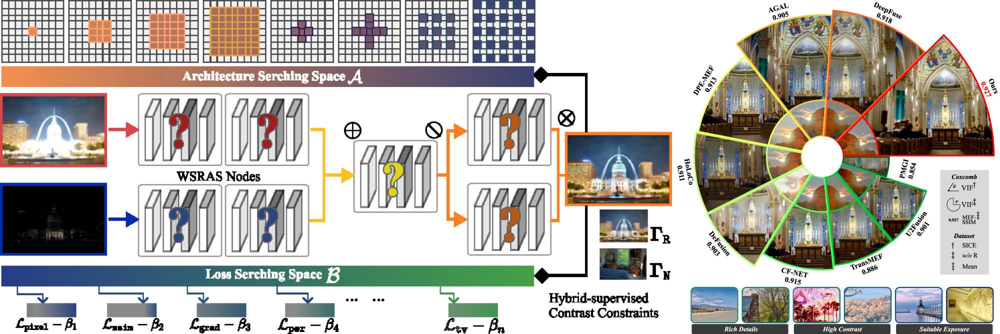

# HSDS_MEF
Official Code for: Guanyao Wu, Hongming Fu, Jinyuan Liu, Long Ma, Xin Fan, Risheng Liu*, **"Hybrid-Supervised Dual-Search: Leveraging Automatic Learning for Loss-Free Multi-Exposure Image Fusion"**,  in Proceedings of the 38th Annual AAAI Conference on Artificial Intelligence (AAAI), 2024.

- [*[GoogleScholar]*](https://scholar.google.com/scholar?hl=zh-CN&as_sdt=0%2C5&q=Hybrid-Supervised+Dual-Search%3A+Leveraging+Automatic+Learning+for+Loss-free+Multi-Exposure+Image+Fusion&btnG=)

## Preview

---


<p align="center">
  
</p>


---


## Set Up on Your Own Machine

### Virtual Environment

We strongly recommend that you use Conda as a package manager.

```shell
# create virtual environment
conda create -n hsds python=3.8
conda activate hsds
# select and install pytorch version yourself (Necessary & Important)
# install requirements package
pip install -r requirements.txt
```

### Test
This code natively supports the same naming for over-/under-exposed image pairs. An naming example can be found in **./data** folder.
```shell
# Test: use given example and save fused color images to ./data/result.
# If you want to test the custom data, please modify the file path in 'test.py'.
python test.py
```


## Citation

If this work has been helpful to you, we would appreciate it if you could cite our paper! 

```
@article{wu2023hybrid,
  title={Hybrid-Supervised Dual-Search: Leveraging Automatic Learning for Loss-free Multi-Exposure Image Fusion},
  author={Wu, Guanyao and Fu, Hongming and Liu, Jinyuan and Ma, Long and Fan, Xin and Liu, Risheng},
  journal={arXiv preprint arXiv:2309.01113},
  year={2023}
}
```
